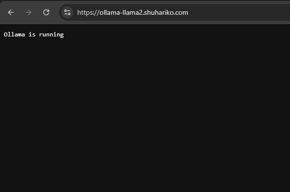
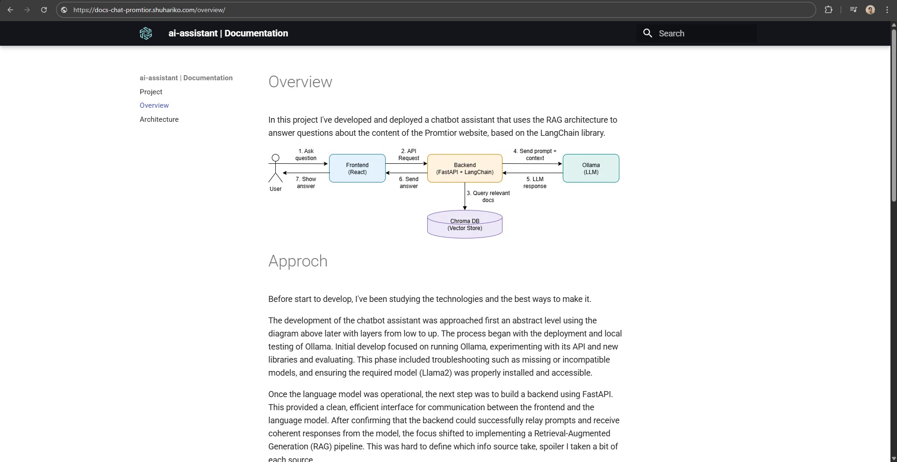
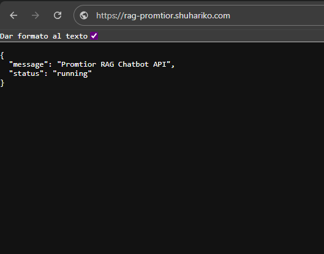
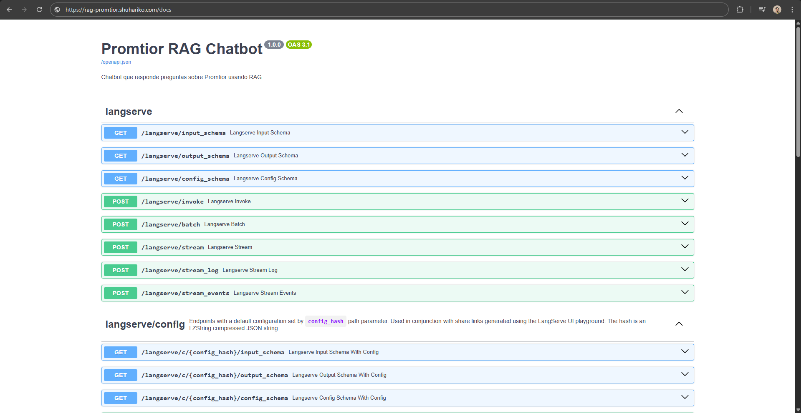
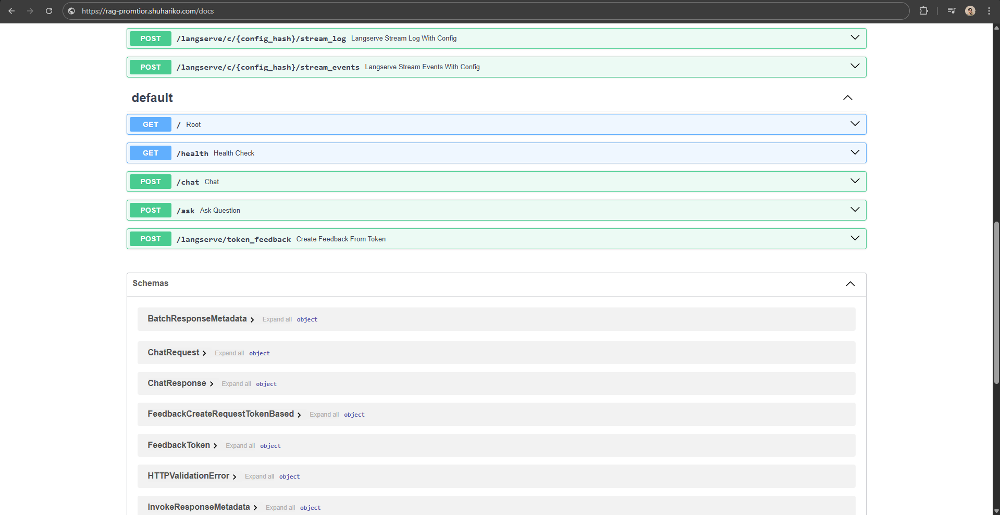
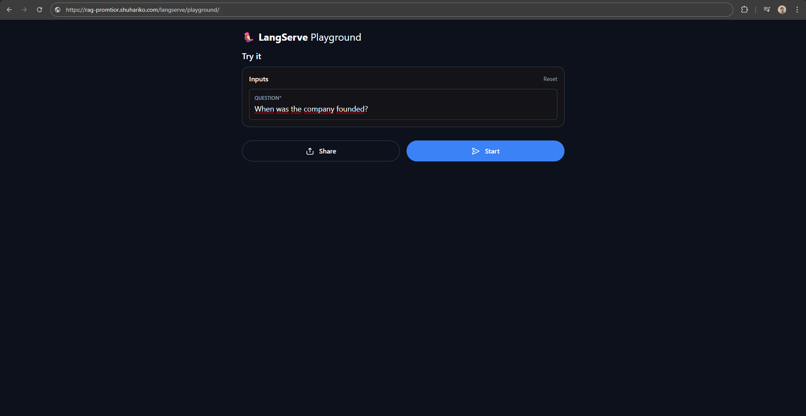

# Introduction

promtior-ai-assistant is a chat developed with Python using FastAPI, Pydantic, uvicorn, LangChain, LangServe and 
TypeScript using React, lucide-react, axios.

The infrastructure used was Azure and a VPS. To deploy it on Azure, manifests were created in Terraform and Ollama
server was deploy it using Helm to be used from the VPS.

# Relevant links

| Description    | Link |
|-----------|------|
| Ollama Server      | [ollama-llama2.shuhariko.com](https://ollama-llama2.shuhariko.com)   |
| Documentation      | [docs-chat-promtior.shuhariko.com](https://docs-chat-promtior.shuhariko.com)   |
| Backend     |  [rag-promtior.shuhariko.com](https://rag-promtior.shuhariko.com)  |
| Frontend     |  [chat-promtior.shuhariko.com](https://chat-promtior.shuhariko.com)   |

# Interesting links

| Description    | Link |
|-----------|------|
| Documentation      | [docs-chat-promtior.shuhariko.com](https://docs-chat-promtior.shuhariko.com)   |
| Swagger     |  [rag-promtior.shuhariko.com](https://rag-promtior.shuhariko.com/docs)  |
| LangServer     |  [rag-promtior.shuhariko.com](https://rag-promtior.shuhariko.com/langserve/playground)  |
| Chat     |  [chat-promtior.shuhariko.com](https://chat-promtior.shuhariko.com)   |

# Screenshots

## Ollama

## Documentation

> I don't know what to show...

## Backend

### Swagger UI

### LangServe Playground

