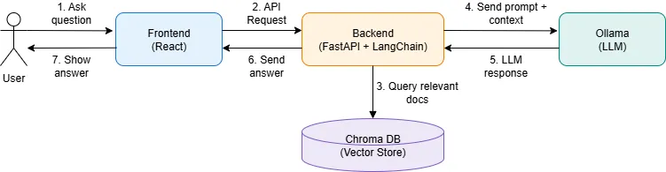

# Overview

In this project I've developed and deployed a chatbot assistant that uses the RAG architecture to answer questions about the 
content of the Promtior website, based on the LangChain library.

# Approch

Before start to develop, I've been studying the technologies and the best ways to make it.

The development of the chatbot assistant was approached first an abstract level using the diagram above later with layers from low to up. The process began with the deployment and local testing of Ollama. Initial develop focused on running Ollama, experimenting with its API and new libraries and evaluating. This phase included troubleshooting such as missing or incompatible models, and ensuring the required model (Llama2) was properly installed and accessible.

Once the language model was operational, the next step was to build a backend using FastAPI. This provided a clean, efficient interface for communication between the frontend and the language model. After confirming that the backend could successfully relay prompts and receive coherent responses from the model, the focus shifted to implementing a Retrieval-Augmented Generation (RAG) pipeline. This was hard to define which info source take, spoiler I taken a bit of each source.

The RAG process was developed iteratively. Initially, context was provided manually to the model. Subsequently, the system was enhanced by scraping content from the Promtior website, and later by incorporating a domain-specific PDF document. This allowed the chatbot to learn and respond based on big knowledge base.

With the backend and RAG pipeline ready, I focus to the frontend, aiming to deliver a simple user-friendly and intuitive interface. The frontend was iteratively improved until it provided something pretty. 

Later I dockerize, both backend and frontend were then containerized using Docker.

A significant challenge come during deployment: due to the my lack of Azure credits, I can't to host a large model like Llama2 on a virtual machine in Azure (to then I've developed the manifests in terraform). I explored options, including deploying the model via Cloudflare Workers, but these proved insufficient for the project's requirements and I look it more complex than needed. Finnally I take the decision was made to deploy the Ollama server on my private VPS using Helm.

To ensure and ease repetitive tasks as build, test, publish and deploy, I develop CI/CD pipeline, enabling continuous integration and deployment for both backend and frontend applications.

Finally, comprehensive documentation was written, and all project details were reviewed to ensure clarity, reproducibility, and ease of future development or evaluation.

# Functionality

The chatbot be able to answer the following questions:

- What services does Promtior offer?
- When was the company founded?

# Technologies 

- Ollama and LlaMA2 as LLM (Large Language Model).
- FastAPI to make simple requests to Ollama and integration with Langserve.
- all-MiniLM-L6-v2 as EM (Embedding Model).
- LangChain with Langserve.
- React to make basic chat UI.
- Terraform to provision infrastructure needed.
- Azure Container Apps to host backend and frontend.
- Private cluster k8s with Helm to host Ollama and docs.
- Github Actions to make CI/CD.
- MkDocs to write this documentation.

